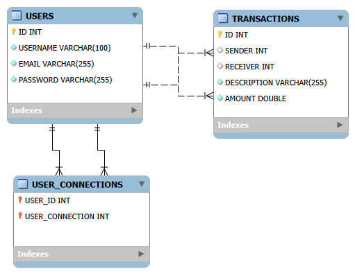

PayMyBuddy

🚧 PROJECT STATUS : UNDER DEVELOPMENT

General Application purpose

PayMyBuddy is a Spring Boot application that allows users to transfer money between each other in order to manage payments and personal financial connections.

This project is developed in a learning context and focuses on backend architecture, database design, and data persistence using Spring Data JPA.

Technical stack
	•	Java 21
	•	Spring Boot
	•	Spring Data JPA
	•	Spring Security
	•	MySQL
	•	Maven
	•	JUnit

  Database

  ##schema

The application uses a MySQL database.

The database structure is initialized automatically at application startup using an SQL script.

📄 SQL script location: src/main/resources/schema.sql

This script:
	•	creates the tables:
	•	users
	•	transactions
	•	user_connections
	•	defines primary keys and foreign keys
	•	inserts default test data into the users and transactions tables

  Configuration (IMPORTANT)

Database credentials are not hardcoded in the project.

The application uses environment variables for the database connection.

The following properties are defined in application.properties:

spring.datasource.url=jdbc:mysql://localhost:3306/paymybuddy?serverTimezone=UTC
spring.datasource.username=${DB_USER}
spring.datasource.password=${DB_PASSWORD}
spring.sql.init.mode=always
spring.jpa.hibernate.ddl-auto=none

Required environment variables

Before running the application, you must define the following environment variables:
	•	DB_USER
	•	DB_PASSWORD

These variables can be configured:
	•	in IntelliJ Run Configuration
	•	or as system environment variables
